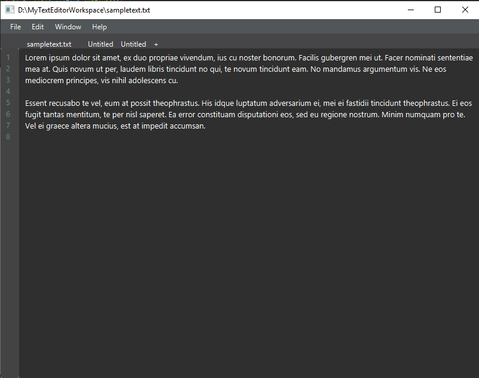

# Simple TextEditorFX
A simple text editor made over the course of winter break, using javafx, that I plan on continuing to work on over time; adding additional features, refactoring, and writing over all cleaner code.

  

## Features
- File Management
- Line Counter
- Workspaces
- Multitab Editor
## Installation
**WIP!!** There are features that are not implemented fully yet.
## Author
Bradley Waddington
